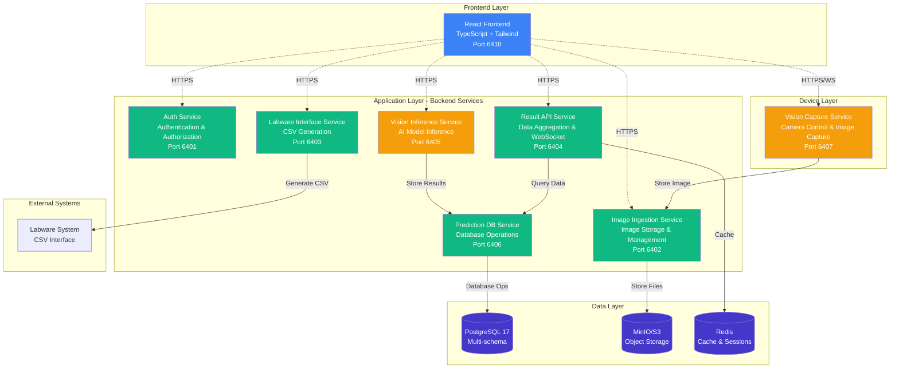

# 🔬 Microplate AI System

> AI-powered microplate image analysis system with comprehensive microservices architecture

[](LICENSE)
[](https://nodejs.org)
[](https://www.python.org)
[](https://www.postgresql.org)
[](https://www.docker.com)

---

## 📋 Table of Contents

- [Overview](#overview)
- [System Architecture](#system-architecture)
- [Key Features](#key-features)
- [Technology Stack](#technology-stack)
- [Project Structure](#project-structure)
- [Quick Start](#quick-start)
- [Documentation](#documentation)
- [Service Ports](#service-ports)
- [Development](#development)
- [Deployment](#deployment)
- [Testing](#testing)
- [Security](#security)
- [Contributing](#contributing)
- [License](#license)

---

## 🎯 Overview

The **Microplate AI System** is a complete end-to-end solution for automated microplate image capture, AI-powered analysis, and seamless integration with labware systems. Built with modern microservices architecture, it provides:

- **Real-time image capture** from USB/CSI cameras
- **AI-powered analysis** using YOLO-based object detection
- **Automated result aggregation** and data management
- **CSV interface** for labware system integration
- **Professional web interface** with React + TypeScript

### Use Cases

- 🧪 Laboratory automation
- 🔬 Microplate well analysis
- 📊 High-throughput screening
- 🤖 AI-assisted quality control
- 📈 Data aggregation and reporting

---

## 🏗️ System Architecture



### Architecture Highlights

- ✅ **Direct Service Access** - No API gateway, services accessed directly
- ✅ **Microservices** - Independent, scalable services
- ✅ **Event-Driven** - Real-time updates via WebSocket
- ✅ **Polyglot** - Node.js/TypeScript + Python where appropriate
- ✅ **Cloud-Ready** - Docker + Kubernetes deployment

---

## ✨ Key Features

### 🔐 Authentication & Security
- JWT-based authentication with refresh token rotation
- Role-based access control (Admin, Operator, Viewer)
- Password reset and email verification
- Service-to-service authentication
- Comprehensive audit logging

### 📸 Image Capture & Processing
- USB/CSI camera support with real-time preview
- High-quality image capture (up to 4K)
- Automatic thumbnail generation
- MinIO/S3 object storage with signed URLs
- Image metadata management

### 🤖 AI-Powered Analysis
- YOLO-based object detection
- 96-well microplate recognition
- Confidence scoring and classification
- Bounding box annotation
- Multiple prediction runs per sample

### 📊 Data Management
- Real-time result aggregation
- Sample history and tracking
- WebSocket live updates
- Comprehensive statistics
- Data export capabilities

### 🔗 System Integration
- CSV file generation for labware systems
- Multiple output formats (standard, detailed, summary)
- Automated file delivery
- Template management
- Shared folder integration

### 💻 Web Interface
- Professional React + TypeScript frontend
- Clean white background design
- Real-time result visualization
- QR code scanner integration
- Responsive design for all devices

---

## 🛠️ Technology Stack

### Backend Services
| Technology | Version | Purpose |
|------------|---------|---------|
| Node.js | 18+ | Runtime for services |
| TypeScript | 5.x | Type-safe development |
| Fastify | 4.x | High-performance web framework |
| Prisma | 5.x | Type-safe ORM |
| PostgreSQL | 17 | Primary database |
| Redis | 7+ | Caching and sessions |
| MinIO | Latest | Object storage (S3-compatible) |

### AI/ML Services
| Technology | Version | Purpose |
|------------|---------|---------|
| Python | 3.11+ | Runtime for AI services |
| FastAPI | Latest | API framework |
| PyTorch/TensorFlow | Latest | ML framework |
| OpenCV | Latest | Image processing |
| YOLO | v8+ | Object detection |

### Frontend
| Technology | Version | Purpose |
|------------|---------|---------|
| React | 18+ | UI framework |
| TypeScript | 5.x | Type-safe JavaScript |
| Tailwind CSS | 3.x | Utility-first CSS |
| TanStack Query | Latest | Data fetching & caching |
| React Router | 6.x | Client-side routing |
| Vite | Latest | Build tool |

### Infrastructure
| Technology | Purpose |
|------------|---------|
| Docker | Containerization |
| Docker Compose | Local orchestration |
| Kubernetes | Production orchestration |
| Nginx | Reverse proxy (optional) |
| Prometheus | Metrics collection |
| Grafana | Monitoring dashboards |

---

## 📁 Project Structure

```
microplate-ai-system/
├── 📂 microplate-be/              # Backend services
│   ├── services/
│   │   ├── auth-service/          # Port 6401 - Authentication
│   │   ├── image-ingestion-service/ # Port 6402 - Image storage
│   │   ├── labware-interface-service/ # Port 6403 - CSV generation
│   │   ├── result-api-service/    # Port 6404 - Result APIs
│   │   ├── vision-inference-service/ # Port 6405 - AI inference
│   │   └── prediction-db-service/ # Port 6406 - Database ops
│   ├── infra/                     # Infrastructure configs
│   │   ├── postgres/              # Database init scripts
│   │   ├── minio/                 # Object storage setup
│   │   ├── redis/                 # Cache configuration
│   │   ├── prometheus/            # Metrics collection
│   │   └── grafana/               # Monitoring dashboards
│   ├── docker-compose.infra.yml   # Infrastructure services
│   ├── docker-compose.apps.yml    # Application services
│   └── README.md
│
├── 📂 microplate-device/          # Device services
│   └── vision-capture-service/    # Port 6407 - Camera control
│       ├── app/                   # FastAPI application
│       ├── docker-compose.yml     # Service deployment
│       └── README.md
│
├── 📂 microplate-fe/              # Frontend application
│   ├── src/
│   │   ├── components/            # React components
│   │   ├── pages/                 # Page components
│   │   ├── services/              # API services
│   │   ├── hooks/                 # Custom hooks
│   │   └── utils/                 # Utilities
│   ├── docker-compose.yml         # Frontend deployment
│   └── README.md
│
└── 📂 docs/                       # Documentation
    ├── 00-Project-Summary.md
    ├── 01-Architecture-Overview.md
    ├── 02-Database-Schema.md
    ├── 03-Auth-Service.md
    ├── 04-Image-Ingestion-Service.md
    ├── 05-Vision-Inference-Service.md
    ├── 06-Result-API-Service.md
    ├── 07-Labware-Interface-Service.md
    ├── 08-Vision-Capture-Service.md
    ├── 09-Direct-Service-Access.md
    ├── 10-Frontend-Design.md
    ├── 11-Implementation-Guide.md
    ├── 12-Deployment-Guide.md
    ├── 13-Prediction-DB-Service.md
    ├── 14-Service-Port-Allocation.md
    ├── 15-API-Reference.md
    ├── 16-Troubleshooting-Guide.md
    ├── 17-Testing-Strategy.md
    ├── 18-Security-Best-Practices.md
    └── README.md
```

---

## 🚀 Quick Start

### Prerequisites

- **Node.js** 18+ ([Download](https://nodejs.org))
- **Python** 3.11+ ([Download](https://www.python.org))
- **Docker** 20+ ([Download](https://www.docker.com))
- **PostgreSQL** 17 (or use Docker)
- **Yarn** 1.22+ (`npm install -g yarn`)

### Installation

1. **Clone the repository**
```bash
git clone <repository-url>
cd microplate-ai-system
```

2. **Start infrastructure services**
```bash
cd microplate-be
docker-compose -f docker-compose.infra.yml up -d
```

3. **Set up environment variables**
```bash
# Copy example files
cp microplate-be/services/auth-service/.env.example microplate-be/services/auth-service/.env
cp microplate-be/services/result-api-service/.env.example microplate-be/services/result-api-service/.env
# ... repeat for all services

# Generate secrets
export JWT_SECRET=$(openssl rand -base64 32)
export JWT_REFRESH_SECRET=$(openssl rand -base64 32)
```

4. **Run database migrations**
```bash
cd microplate-be/services/auth-service
yarn install
yarn prisma migrate deploy
```

5. **Start backend services**
```bash
cd microplate-be
docker-compose -f docker-compose.apps.yml up -d
```

6. **Start frontend**
```bash
cd microplate-fe
yarn install
yarn dev
```

7. **Start device services (if using camera)**
```bash
cd microplate-device/vision-capture-service
python -m venv venv
source venv/bin/activate  # Windows: venv\Scripts\activate
pip install -r requirements.txt
python run.py
```

8. **Access the application**
- Frontend: http://localhost:6410
- Auth Service: http://localhost:6401
- Result API: http://localhost:6404

### Default Credentials

```
Email: admin@example.com
Password: admin123 (change after first login)
```

---

## 📚 Documentation

### Core Documentation

| Document | Description |
|----------|-------------|
| [00-Project-Summary](docs/00-Project-Summary.md) | **Start Here** - Complete project overview |
| [01-Architecture-Overview](docs/01-Architecture-Overview.md) | System architecture and design patterns |
| [02-Database-Schema](docs/02-Database-Schema.md) | Complete database design with ERD |

### Service Documentation

| Service | Port | Documentation |
|---------|------|---------------|
| Auth Service | 6401 | [03-Auth-Service.md](docs/03-Auth-Service.md) |
| Image Ingestion | 6402 | [04-Image-Ingestion-Service.md](docs/04-Image-Ingestion-Service.md) |
| Labware Interface | 6403 | [07-Labware-Interface-Service.md](docs/07-Labware-Interface-Service.md) |
| Result API | 6404 | [06-Result-API-Service.md](docs/06-Result-API-Service.md) |
| Vision Inference | 6405 | [05-Vision-Inference-Service.md](docs/05-Vision-Inference-Service.md) |
| Prediction DB | 6406 | [13-Prediction-DB-Service.md](docs/13-Prediction-DB-Service.md) |
| Vision Capture | 6407 | [08-Vision-Capture-Service.md](docs/08-Vision-Capture-Service.md) |

### Architecture & Design

| Document | Description |
|----------|-------------|
| [09-Direct-Service-Access](docs/09-Direct-Service-Access.md) | Why no API Gateway? Direct service access strategy |
| [10-Frontend-Design](docs/10-Frontend-Design.md) | Frontend architecture and components |
| [14-Service-Port-Allocation](docs/14-Service-Port-Allocation.md) | Port allocation and network configuration |

### Implementation & Deployment

| Document | Description |
|----------|-------------|
| [11-Implementation-Guide](docs/11-Implementation-Guide.md) | Step-by-step implementation guide |
| [12-Deployment-Guide](docs/12-Deployment-Guide.md) | Production deployment guide |
| [15-API-Reference](docs/15-API-Reference.md) | Complete API documentation |

### Operations & Security

| Document | Description |
|----------|-------------|
| [16-Troubleshooting-Guide](docs/16-Troubleshooting-Guide.md) | Common issues and solutions |
| [17-Testing-Strategy](docs/17-Testing-Strategy.md) | Comprehensive testing guide |
| [18-Security-Best-Practices](docs/18-Security-Best-Practices.md) | Security guidelines and best practices |

---

## 🔌 Service Ports

| Service | Port | Protocol | Status |
|---------|------|----------|--------|
| **Auth Service** | 6401 | HTTP | ✅ |
| **Image Ingestion** | 6402 | HTTP | ✅ |
| **Labware Interface** | 6403 | HTTP | ✅ |
| **Result API** | 6404 | HTTP/WebSocket | ✅ |
| **Vision Inference** | 6405 | HTTP | ✅ |
| **Prediction DB** | 6406 | HTTP | ✅ |
| **Vision Capture** | 6407 | HTTP/WebSocket | ✅ |
| **Frontend** | 6410 | HTTP | ✅ |
| **PostgreSQL** | 5432 | PostgreSQL | ✅ |
| **Redis** | 6379 | Redis | ✅ |
| **MinIO** | 9000 | HTTP (S3 API) | ✅ |
| **MinIO Console** | 9001 | HTTP | ✅ |

### Health Checks

```bash
# Check all services
curl http://localhost:6401/healthz  # Auth
curl http://localhost:6402/healthz  # Image Ingestion
curl http://localhost:6403/healthz  # Labware Interface
curl http://localhost:6404/api/v1/results/health  # Result API
curl http://localhost:6405/api/v1/inference/health  # Vision Inference
curl http://localhost:6406/health  # Prediction DB
curl http://localhost:6407/api/v1/capture/health  # Vision Capture
```

---

## 💻 Development

### Backend Development

```bash
# Start infrastructure
cd microplate-be
docker-compose -f docker-compose.infra.yml up -d

# Develop individual service
cd services/result-api-service
yarn install
yarn dev

# Run tests
yarn test

# Run linting
yarn lint
```

### Frontend Development

```bash
cd microplate-fe
yarn install
yarn dev

# Run tests
yarn test

# Build for production
yarn build
```

### Python Service Development

```bash
cd microplate-device/vision-capture-service
python -m venv venv
source venv/bin/activate
pip install -r requirements.txt

# Run service
python run.py

# Run tests
pytest
```

### Database Management

```bash
# Create migration
cd services/auth-service
yarn prisma migrate dev --name migration_name

# Deploy migrations
yarn prisma migrate deploy

# Open Prisma Studio
yarn prisma studio

# Reset database (⚠️ Development only!)
yarn prisma migrate reset
```

---

## 🚢 Deployment

### Docker Compose (Recommended for development)

```bash
# Start all services
docker-compose -f docker-compose.infra.yml up -d
docker-compose -f docker-compose.apps.yml up -d

# View logs
docker-compose logs -f

# Stop all services
docker-compose down
```

### Kubernetes (Recommended for production)

```bash
# Deploy infrastructure
kubectl apply -f k8s/namespace.yaml
kubectl apply -f k8s/configmap.yaml
kubectl apply -f k8s/secrets.yaml
kubectl apply -f k8s/postgres.yaml
kubectl apply -f k8s/redis.yaml
kubectl apply -f k8s/minio.yaml

# Deploy services
kubectl apply -f k8s/auth-service.yaml
kubectl apply -f k8s/result-api-service.yaml
# ... other services

# Check status
kubectl get pods -n microplate-ai
kubectl get services -n microplate-ai
```

See [12-Deployment-Guide.md](docs/12-Deployment-Guide.md) for detailed deployment instructions.

---

## 🧪 Testing

### Unit Tests

```bash
# Backend services
cd services/result-api-service
yarn test:unit

# Frontend
cd microplate-fe
yarn test

# Python services
cd microplate-device/vision-capture-service
pytest tests/
```

### Integration Tests

```bash
# Start test environment
docker-compose -f docker-compose.test.yml up -d

# Run integration tests
yarn test:integration
```

### E2E Tests

```bash
# Run Cypress tests
cd microplate-fe
yarn test:e2e

# Run with UI
yarn test:e2e:ui
```

### Performance Tests

```bash
# Install k6
brew install k6

# Run load tests
k6 run tests/performance/load-test.js
```

See [17-Testing-Strategy.md](docs/17-Testing-Strategy.md) for comprehensive testing guide.

---

## 🔐 Security

### Security Features

- ✅ JWT authentication with refresh token rotation
- ✅ Argon2id password hashing
- ✅ Role-based access control (RBAC)
- ✅ Input validation and sanitization
- ✅ SQL injection prevention (Prisma ORM)
- ✅ XSS protection
- ✅ CORS configuration
- ✅ Rate limiting
- ✅ Audit logging
- ✅ Secure headers (Helmet)

### Best Practices

```bash
# Generate strong secrets
export JWT_SECRET=$(openssl rand -base64 32)
export JWT_REFRESH_SECRET=$(openssl rand -base64 32)
export ENCRYPTION_KEY=$(openssl rand -hex 32)

# Scan for vulnerabilities
docker scan microplate-ai/service:latest
trivy image microplate-ai/service:latest

# Run security tests
yarn test:security
```

See [18-Security-Best-Practices.md](docs/18-Security-Best-Practices.md) for complete security guidelines.

---

## 🤝 Contributing

We welcome contributions! Please follow these guidelines:

### Development Workflow

1. Fork the repository
2. Create a feature branch (`git checkout -b feature/amazing-feature`)
3. Commit your changes (`git commit -m 'Add amazing feature'`)
4. Push to the branch (`git push origin feature/amazing-feature`)
5. Open a Pull Request

### Code Standards

- **TypeScript**: Follow ESLint rules, use strict mode
- **Python**: Follow PEP 8, use type hints
- **Commits**: Use conventional commit messages
- **Tests**: Write tests for new features
- **Documentation**: Update docs for API changes

### Pull Request Checklist

- [ ] Code follows project style guidelines
- [ ] Tests added/updated and passing
- [ ] Documentation updated
- [ ] No linter errors
- [ ] Security best practices followed
- [ ] All CI checks passing

---

## 📄 License

This project is licensed under the **MIT License** - see the [LICENSE](LICENSE) file for details.

---

## 🙏 Acknowledgments

### Technologies

- [Node.js](https://nodejs.org) - JavaScript runtime
- [Python](https://www.python.org) - Programming language
- [React](https://react.dev) - UI framework
- [Fastify](https://fastify.io) - Web framework
- [Prisma](https://www.prisma.io) - Database ORM
- [PostgreSQL](https://www.postgresql.org) - Database
- [Docker](https://www.docker.com) - Containerization
- [Tailwind CSS](https://tailwindcss.com) - CSS framework

### Contributors

Thank you to all contributors who have helped build this system!

---

## 📞 Support

### Documentation

- 📖 [Full Documentation](docs/README.md)
- 🔧 [Troubleshooting Guide](docs/16-Troubleshooting-Guide.md)
- 🔐 [Security Best Practices](docs/18-Security-Best-Practices.md)

### Getting Help

- 📧 Email: support@microplate-ai.com
- 💬 Discord: [Join our community](https://discord.gg/microplate-ai)
- 🐛 Issues: [GitHub Issues](https://github.com/your-org/microplate-ai/issues)

---

## 🗺️ Roadmap

### Current Version (v1.0)
- ✅ Complete microservices architecture
- ✅ AI-powered image analysis
- ✅ Real-time result aggregation
- ✅ CSV interface for labware systems
- ✅ Professional web interface

### Upcoming Features (v1.1)
- 🔄 Model versioning and management
- 📊 Advanced analytics dashboard
- 📱 Mobile application
- 🔔 Email/SMS notifications
- 🌐 Multi-language support

### Future Plans (v2.0)
- 🤖 Multiple AI model support
- 🔬 Batch processing capabilities
- 📈 Custom dashboard builder
- 🔗 Extended labware integrations
- ☁️ Cloud-native deployment options

---

## 📊 Project Status


**Last Updated:** January 2024  
**Version:** 1.0.0  
**Status:** Production Ready

---

<div align="center">

Made with ❤️ by the Microplate AI Team

[Documentation](docs/) • [API Reference](docs/15-API-Reference.md) • [Contributing](#contributing) • [License](#license)

</div>

